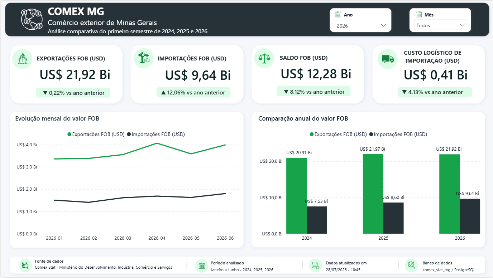
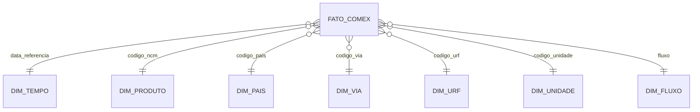
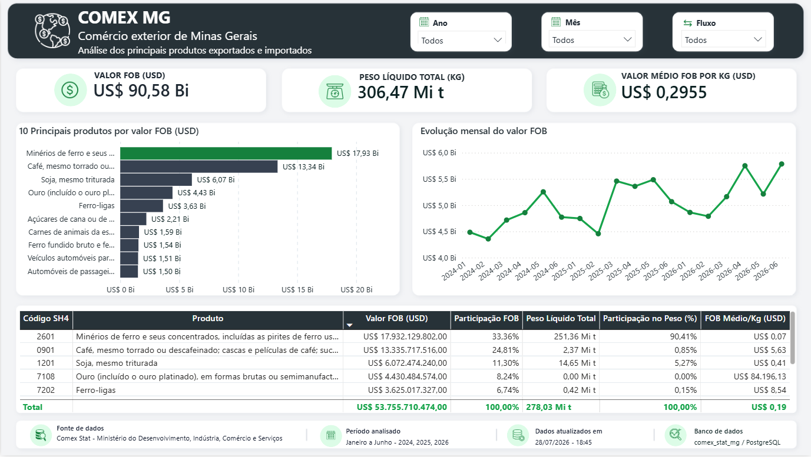
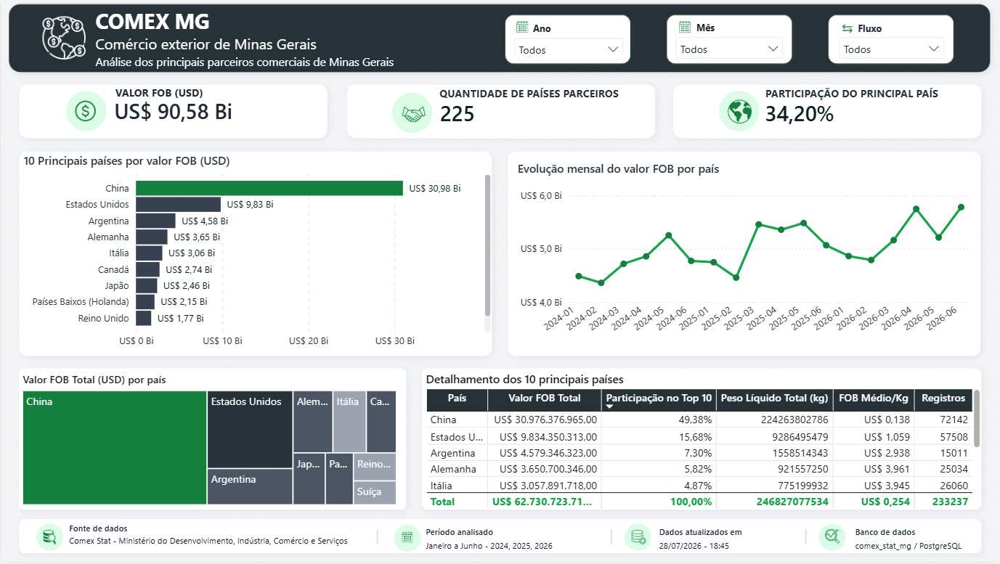
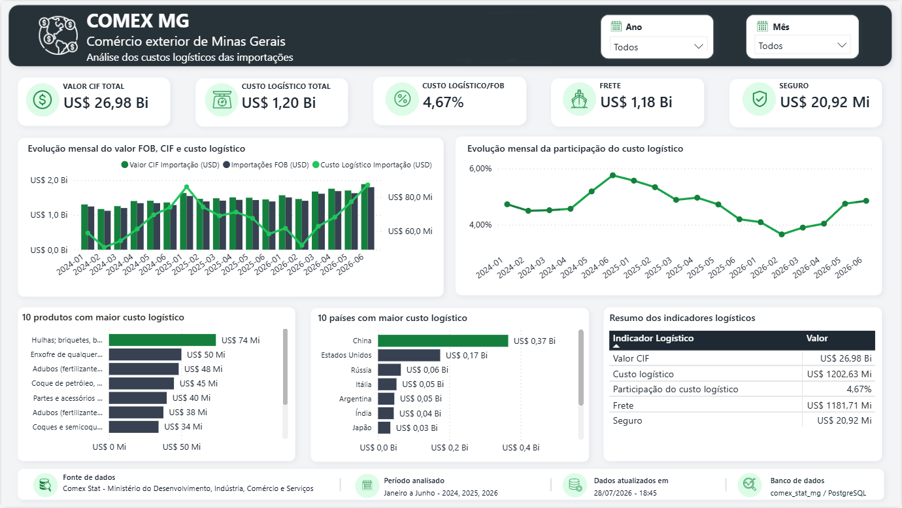

# Engenharia de Dados — Comex Stat MG

Projeto ponta a ponta de engenharia e análise de dados sobre o comércio exterior de Minas Gerais, utilizando dados oficiais do Comex Stat.

O pipeline contempla ingestão de arquivos CSV, transformação com Python, validação de qualidade, modelagem dimensional, carga no PostgreSQL, criação de uma camada analítica segura e construção de dashboards no Power BI.

<p align="center">
  
</p>

## Visão geral

O projeto analisa exportações e importações de Minas Gerais nos primeiros semestres de 2024, 2025 e 2026.

| Item | Escopo |
|---|---|
| Unidade federativa | Minas Gerais |
| Período | Janeiro a junho de 2024, 2025 e 2026 |
| Fluxos | Exportação e importação |
| Granularidade | Operações por produto NCM, país, via, URF, unidade e mês |
| Fonte | Comex Stat — MDIC |
| Registros na tabela fato | 434.837 |

### Objetivos

- Construir um pipeline de dados reprodutível a partir dos arquivos anuais do Comex Stat.
- Aplicar tratamentos, padronizações e validações antes da carga no banco.
- Modelar os dados em esquema estrela.
- Disponibilizar uma camada de leitura específica para ferramentas de BI.
- Analisar evolução comercial, produtos, parceiros e custos logísticos.
- Apresentar os resultados em um dashboard interativo no Power BI.

## Tecnologias

- **Python** — ingestão, transformação e validação
- **Pandas** — processamento dos arquivos CSV
- **PostgreSQL** — armazenamento e camada analítica
- **SQL** — DDL, carga, índices, consultas e views
- **Power BI** — modelagem semântica, DAX e visualização
- **Git e GitHub** — versionamento
- **PowerShell** — execução local no Windows

## Arquitetura

```mermaid
flowchart LR
    A[Comex Stat<br>CSVs anuais] --> B[data/raw]
    B --> C[Python<br>ingestão e filtros]
    C --> D[data/interim]
    D --> E[Validações de qualidade]
    E --> F[Dimensões e tabela fato]
    F --> G[data/processed]
    G --> H[(PostgreSQL<br>schema comex)]
    H --> I[Views analíticas<br>schema bi]
    I --> J[Usuário somente leitura<br>powerbi_reader]
    J --> K[Power BI<br>modelo estrela e DAX]
    K --> L[Dashboards]
```



### Camadas do pipeline

1. **Raw:** arquivos originais e referências oficiais.
2. **Interim:** dados filtrados para Minas Gerais, meses 1 a 6 e anos selecionados.
3. **Processed:** dimensões e tabela fato preparadas para a carga.
4. **PostgreSQL — `comex`:** armazenamento dimensional.
5. **PostgreSQL — `bi`:** views consumidas pelo Power BI.
6. **Power BI:** modelo semântico, medidas e dashboards.

## Modelo dimensional

A tabela `fato_comex` concentra as métricas comerciais e se relaciona diretamente com as dimensões.



### Views disponibilizadas ao Power BI

| View | Registros |
|---|---:|
| `bi.fato_comex` | 434.837 |
| `bi.dim_tempo` | 18 |
| `bi.dim_produto` | 13.745 |
| `bi.dim_pais` | 281 |
| `bi.dim_via` | 17 |
| `bi.dim_urf` | 281 |
| `bi.dim_unidade` | 15 |
| `bi.dim_fluxo` | 2 |

Os campos de código foram mantidos como texto para preservar zeros à esquerda. Frete, seguro e CIF permanecem nulos nas exportações, pois não se aplicam a esse fluxo.

## Qualidade e validação

O pipeline realiza verificações antes e depois da carga:

- conferência do recorte por UF, ano, mês e fluxo;
- validação de tipos e colunas obrigatórias;
- verificação de chaves sem correspondência nas dimensões;
- comparação de contagens e totais monetários;
- validação entre arquivos processados, PostgreSQL e Power BI;
- confirmação de que todas as chaves da fato estão cobertas pelas dimensões.

```text
Total de linhas analisadas: 434.837
Correspondências ausentes nas dimensões: 0
Status das cargas e totais: aprovado
```

## Segurança da camada de BI

O Power BI utiliza a role `powerbi_reader`, com acesso somente de leitura ao schema `bi`.

```sql
GRANT CONNECT ON DATABASE comex_stat_mg TO powerbi_reader;
GRANT USAGE ON SCHEMA bi TO powerbi_reader;
GRANT SELECT ON ALL TABLES IN SCHEMA bi TO powerbi_reader;

REVOKE INSERT, UPDATE, DELETE, TRUNCATE
ON ALL TABLES IN SCHEMA bi
FROM powerbi_reader;
```

## Principais resultados

### Resumo anual — janeiro a junho

| Ano | Exportações FOB | Importações FOB | Saldo FOB |
|---:|---:|---:|---:|
| 2024 | US$ 20,91 bi | US$ 7,53 bi | US$ 13,38 bi |
| 2025 | US$ 21,97 bi | US$ 8,60 bi | US$ 13,37 bi |
| 2026 | US$ 21,92 bi | US$ 9,64 bi | US$ 12,28 bi |

### Variações

- As exportações cresceram **5,06% em 2025** e recuaram **0,22% em 2026**.
- As importações cresceram **14,26% em 2025** e **12,06% em 2026**.
- O saldo comercial permaneceu praticamente estável em 2025 e caiu **8,12% em 2026**.
- O custo logístico das importações foi de **US$ 408,55 milhões em 2026**, queda de **4,13%** em relação a 2025.
- Em 2026, frete e seguro representaram **4,24% do valor FOB importado**.

## Dashboard Power BI

O relatório possui uma página de validação e quatro páginas analíticas principais.

### Visão Geral

<p align="center">
  
</p>

### Produtos

<p align="center">
  
</p>

### Países

<p align="center">
  
</p>

### Logística

<p align="center">
  
</p>

O arquivo do relatório está em:

```text
powerbi/comex_stat_mg_dashboard.pbix
```

## Estrutura do repositório

```text
engenharia-de-dados-comex-stat/
├── data/
│   ├── raw/
│   ├── interim/
│   └── processed/
├── docs/
│   ├── analises/
│   ├── imagens/
│   ├── arquitetura.md
│   ├── dicionario-dados.md
│   ├── etl.md
│   ├── modelo-dimensional.md
│   └── powerbi.md
├── powerbi/
│   └── comex_stat_mg_dashboard.pbix
├── sql/
│   ├── ddl/
│   ├── queries/
│   ├── security/
│   └── views/
├── src/
│   ├── ingestion/
│   ├── transformation/
│   └── validation/
├── .env.example
├── .gitignore
├── README.md
└── requirements.txt
```

## Consultas SQL

O diretório `sql/queries` contém consultas para resumo anual, evolução mensal, produtos, países, relação produto-país, vias e URFs e custos de importação.

O diretório `sql/ddl` contém a criação do banco, schemas, dimensões, fato, carga e índices. As views do Power BI estão em `sql/views`, e as permissões de leitura estão em `sql/security`.

## Como executar

### Pré-requisitos

- Python 3
- PostgreSQL
- Power BI Desktop
- Git

### 1. Clonar o repositório

```bash
git clone https://github.com/yasmimazevedo/engenharia-de-dados-comex-stat.git
cd engenharia-de-dados-comex-stat
```

### 2. Criar o ambiente virtual

```powershell
python -m venv .venv
.venv\Scripts\Activate.ps1
pip install -r requirements.txt
```

### 3. Configurar o ambiente

```powershell
Copy-Item .env.example .env
```

Informe as credenciais locais no `.env` e não versione esse arquivo.

### 4. Executar o pipeline Python

Execute os módulos dos diretórios abaixo na ordem:

```text
src/ingestion
src/transformation
src/validation
```

Consulte `docs/etl.md` para a ordem detalhada dos scripts e parâmetros.

### 5. Criar e carregar o PostgreSQL

Execute os arquivos de `sql/ddl` em ordem numérica. Depois, execute as consultas de validação, crie as views e aplique o script de segurança.

### 6. Abrir o Power BI

```text
powerbi/comex_stat_mg_dashboard.pbix
```

Fonte utilizada:

```text
Servidor: localhost:5432
Banco: comex_stat_mg
Usuário: powerbi_reader
```

## Documentação

- [Arquitetura](docs/arquitetura.md)
- [ETL](docs/etl.md)
- [Modelo dimensional](docs/modelo-dimensional.md)
- [Dicionário de dados](docs/dicionario-dados.md)
- [Power BI](docs/powerbi.md)
- [Análises](docs/analises/)

## Decisões de projeto

- Uso dos arquivos anuais oficiais para preservar granularidade e colunas.
- Comparação de janeiro a junho para manter períodos homogêneos.
- Separação das camadas `raw`, `interim` e `processed`.
- Esquema estrela no PostgreSQL e no Power BI.
- Schema `bi` específico para consumo analítico.
- Usuário somente leitura para o Power BI.
- Valores de frete, seguro e CIF aplicados apenas às importações.
- Ausência de conclusões causais sem evidência suficiente.

## Status

- [x] Ingestão dos dados oficiais
- [x] Transformação e recorte analítico
- [x] Validações de qualidade
- [x] Dimensões e tabela fato
- [x] PostgreSQL, carga e índices
- [x] Consultas analíticas
- [x] Views para BI
- [x] Segurança e usuário somente leitura
- [x] Modelo estrela no Power BI
- [x] Medidas DAX
- [x] Dashboards
- [x] Documentação técnica
- [x] README

## Autoria

Desenvolvido por **Yasmim Azevedo Silva** como projeto de portfólio em Engenharia de Dados e Business Intelligence.

Fonte dos dados: **Comex Stat — Ministério do Desenvolvimento, Indústria, Comércio e Serviços**.
