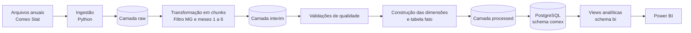

# Arquitetura da solução

## Objetivo

O projeto implementa um pipeline de Engenharia de Dados para coletar, tratar, validar, armazenar e analisar dados do comércio exterior de Minas Gerais.

A solução utiliza arquivos públicos do Comex Stat, processamento em Python, armazenamento analítico no PostgreSQL e visualização no Power BI.

## Visão geral



## Camadas de dados

### Raw

Contém os arquivos originais, preservados sem alteração.

```text
data/raw/
├── exportacao/
├── importacao/
└── reference/
```

Os arquivos de exportação e importação são separados por fluxo e ano. Os arquivos de referência contêm cadastros como NCM, países, vias de transporte, unidades e unidades da Receita Federal.

### Interim

Contém os arquivos filtrados para Minas Gerais e para o primeiro semestre.

```text
data/interim/
├── exportacao_mg/
└── importacao_mg/
```

Essa camada reduz o volume processado nas etapas seguintes e preserva um resultado intermediário auditável.

### Processed

Contém os arquivos preparados para carga no banco de dados.

```text
data/processed/
├── dimensions/
└── fato_comex/
```

### PostgreSQL

O banco `comex_stat_mg` utiliza dois schemas:

- `comex`: tabelas físicas do modelo dimensional;
- `bi`: views preparadas para consumo do Power BI.

### Power BI

O Power BI conecta-se ao PostgreSQL com um usuário somente leitura e importa as views do schema `bi`.

## Componentes

| Componente | Responsabilidade |
|---|---|
| Python | Ingestão, transformação, validação e construção dos arquivos analíticos |
| Pandas | Processamento tabular em chunks |
| PostgreSQL | Persistência, integridade, índices e consultas SQL |
| SQL | DDL, carga, validações, análises, views e segurança |
| Power BI | Modelo semântico, medidas DAX e visualizações |
| Git/GitHub | Versionamento do código, SQL, documentação e arquivo PBIX |

## Decisões de arquitetura

### Arquivos anuais em vez de consultas pequenas à API

O projeto utiliza os arquivos anuais completos porque eles permitem trabalhar com granularidade NCM e com todas as colunas necessárias ao modelo. A ingestão local também facilita reprocessamento, auditoria e reprodução do pipeline.

### Processamento em chunks

Os CSVs possuem milhões de linhas. O processamento em blocos reduz o consumo de memória e permite acompanhar o progresso da transformação.

### Download retomável

O script de ingestão preserva partes já baixadas e retoma a transferência a partir do último byte armazenado. Essa estratégia foi necessária porque algumas conexões eram interrompidas durante o download.

### Modelo estrela

A tabela `fato_comex` fica no centro do modelo e é relacionada diretamente às dimensões. Não há relacionamentos entre dimensões no modelo do Power BI.

### Camada de views para BI

O Power BI não acessa diretamente todas as estruturas internas. As views do schema `bi` apresentam nomes e cálculos adequados para o relatório e permitem restringir as permissões do usuário de leitura.
