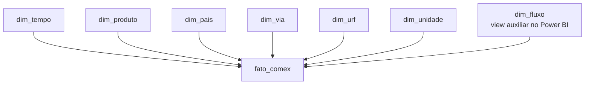

# Modelo dimensional

## Objetivo

O modelo dimensional foi criado para facilitar análises de comércio exterior por período, produto, país, via de transporte, unidade da Receita Federal, unidade estatística e fluxo.

## Granularidade da tabela fato

Cada linha da `fato_comex` representa um registro agregado do arquivo do Comex Stat para uma combinação de atributos como:

- fluxo;
- ano e mês;
- NCM;
- país parceiro;
- unidade federativa;
- via de transporte;
- unidade da Receita Federal;
- unidade estatística;
- arquivo de origem.

Uma linha não deve ser interpretada necessariamente como uma única transação comercial.

## Modelo estrela



## Relacionamentos

| Dimensão | Chave da dimensão | Chave na fato | Cardinalidade |
|---|---|---|---|
| `dim_tempo` | `data_referencia` | `data_referencia` | 1 para muitos |
| `dim_produto` | `codigo_ncm` | `codigo_ncm` | 1 para muitos |
| `dim_pais` | `codigo_pais` | `codigo_pais` | 1 para muitos |
| `dim_via` | `codigo_via` | `codigo_via` | 1 para muitos |
| `dim_urf` | `codigo_urf` | `codigo_urf` | 1 para muitos |
| `dim_unidade` | `codigo_unidade` | `codigo_unidade` | 1 para muitos |
| `dim_fluxo` | `fluxo` | `fluxo` | 1 para muitos |

No Power BI, todos os relacionamentos são ativos e utilizam direção de filtro única, da dimensão para a fato.

## Tabela fato

### Medidas principais

- quantidade estatística;
- peso líquido em quilogramas;
- valor FOB em dólares;
- frete em dólares;
- seguro em dólares;
- valor CIF em dólares.

Frete, seguro e CIF são informações aplicáveis às importações. Nas exportações, esses campos permanecem nulos.

## Dimensões

### `dim_produto`

Reúne a NCM e sua hierarquia:

```text
NCM de 8 dígitos
SH6 de 6 dígitos
SH4 de 4 dígitos
SH2 de 2 dígitos
Seção
Unidade estatística
```

### `dim_tempo`

Possui uma linha para cada mês do recorte, totalizando 18 registros.

### `dim_pais`

Contém o código usado pelo Comex Stat, códigos ISO e o nome do país.

### `dim_via`

Descreve a via de transporte.

### `dim_urf`

Descreve a unidade da Receita Federal responsável pelo despacho.

### `dim_unidade`

Descreve a unidade estatística usada para a quantidade do produto.

## Integridade

As chaves de códigos são tratadas como texto para preservar zeros à esquerda. A cobertura referencial foi validada antes da carga da tabela fato.
